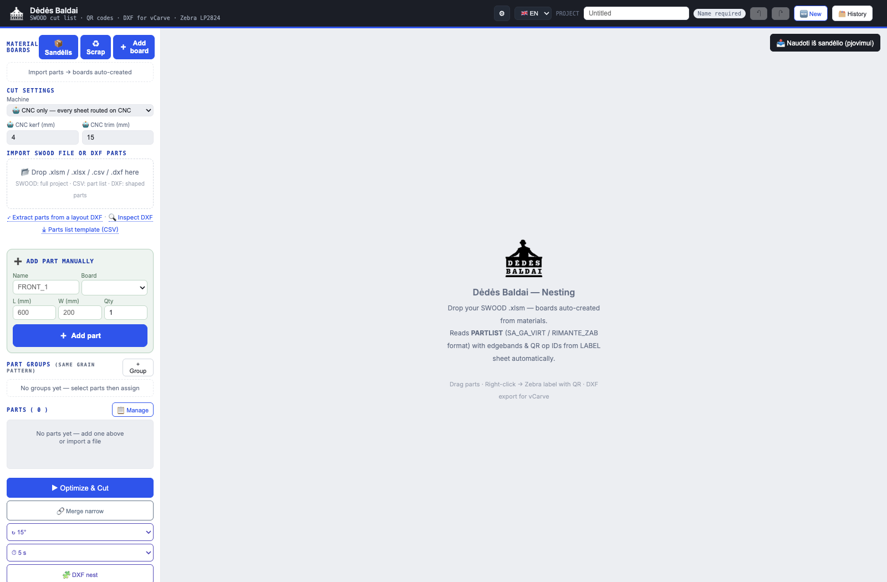

# Nesting — cut optimisation with a true-shape engine

**Less offcut per sheet is money, on every sheet.** Imports the workshop's real CAD output,
nests it, and produces the cut list, the labels and the machine files.



**Live:** <https://gervdalius-droid.github.io/nesting/>

## Why this exists

Sheet material is the biggest consumable in the shop. Commercial nesting is sold per seat per
month and still doesn't read our file formats without an export dance. This reads what SWOOD
actually produces and nests it in the browser.

## What it does

**Imports what the shop already has** — a SWOOD project (`.xlsm` / `.xlsx`), a CSV part list,
or shaped parts straight from **DXF**. Boards are auto-created from the project's materials.
It reads the `PARTLIST` sheet (`SA_GA_VIRT` / `RIMANTE_ZAB` formats) and picks up edgebands
and QR operation IDs from the `LABEL` sheet automatically.

**Two nesting modes, deliberately different:**

| | Engine | For |
|---|---|---|
| **Optimize & Cut** | rectangular strip packing | panels — the 95 % case, fast |
| **Shape nest** | [jagua-rs](https://github.com/JeroenGar/jagua-rs) compiled to WebAssembly | irregular / curved parts from DXF |

The true-shape engine is Rust compiled with `wasm-bindgen-rayon`, so it runs multi-threaded in
Web Workers behind `SharedArrayBuffer` (which is why the page ships `coi-serviceworker.js` to
get itself cross-origin isolated on GitHub Pages).

**Outputs the shop actually uses** — cut list, Zebra LP2824 labels with QR codes (scan a part
at a station and it's tracked), and DXF export for vCarve.

**Part groups** keep parts that share a grain pattern together, and offcuts/scrap can be fed
back in from the warehouse so a usable remnant gets used instead of re-cut from a full sheet.

## Things I learned the hard way

- **Finer rotation steps make the result worse.** Intuitively more angles should pack tighter;
  in practice the extra candidates starve the left-bottom-fill heuristic. Coarser steps plus
  more random restarts beat finer steps.
- **Demand grouping pays for the search.** Collapsing identical parts into a demand count frees
  enough time budget to run a best-of-many seed search, which is where the real gain is.
- **`nestPoly` must stay full-resolution.** Simplifying the polygon before nesting loses exactly
  the concavities that let parts interlock.
- **Adding a DXF entity type touches seven places** — and the easy one to miss is the `commit()`
  whitelist, which silently drops the entity instead of erroring.

## Run it

```bash
python3 -m http.server 8080    # then open http://localhost:8080/
```

Needs cross-origin isolation for the threaded WASM engine — handled by `coi-serviceworker.js`
when served over HTTP.

## Built with

Vanilla JavaScript (~17,000 lines) · Rust → WebAssembly (jagua-rs, wasm-bindgen-rayon) ·
Web Workers · SharedArrayBuffer · Supabase for the shared warehouse/offcut stock.

## Note on the warehouse login

This repo contains the client for a workshop-internal Supabase project. The anon key is
public by design and the tables are protected by row-level security — see
[`WAREHOUSE_AUTH_SETUP.md`](WAREHOUSE_AUTH_SETUP.md). The nesting itself runs entirely
locally and doesn't need an account.
